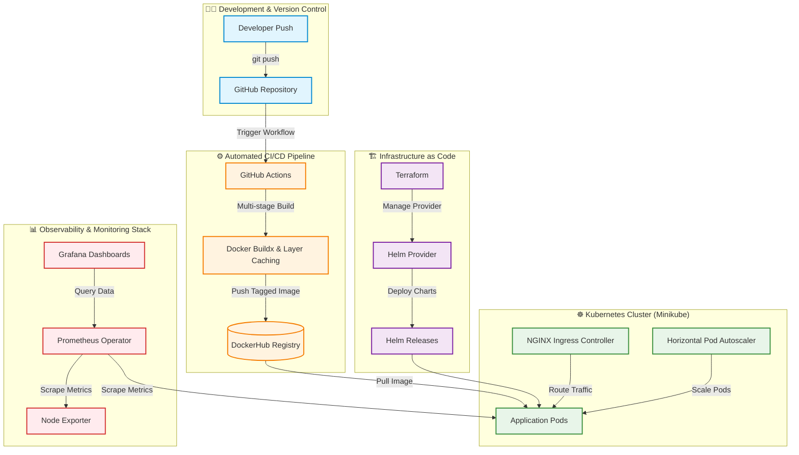

# DevOps Practice & Portfolio Project

## System Architecture

```mermaid
graph TD
    %% Developer & VCS Layer
    subgraph DevLayer ["👨‍💻 Development & Version Control"]
        Dev["Developer Push"] -->|git push| GH["GitHub Repository"]
    end

    %% CI/CD Automation Layer
    subgraph CILayer ["⚙️ Automated CI/CD Pipeline"]
        GH -->|Trigger Workflow| GHA["GitHub Actions"]
        GHA -->|Multi-stage Build| Build["Docker Buildx & Layer Caching"]
        Build -->|Push Tagged Image| DH[("DockerHub Registry")]
    end

    %% Infrastructure & GitOps Layer
    subgraph IaCLayer ["🏗️ Infrastructure as Code"]
        TF["Terraform"] -->|Manage Provider| HelmP["Helm Provider"]
        HelmP -->|Deploy Charts| Release["Helm Releases"]
    end

    %% Kubernetes Runtime Layer
    subgraph K8sLayer ["☸️ Kubernetes Cluster (Minikube)"]
        DH -->|Pull Image| AppPods["Application Pods"]
        Release --> AppPods
        Ingress["NGINX Ingress Controller"] -->|Route Traffic| AppPods
        HPA["Horizontal Pod Autoscaler"] -->|Scale Pods| AppPods
    end

    %% Observability Layer
    subgraph ObsLayer ["📊 Observability & Monitoring Stack"]
        Prom["Prometheus Operator"] -->|Scrape Metrics| AppPods
        Prom -->|Scrape Metrics| NodeExp["Node Exporter"]
        Grafana["Grafana Dashboards"] -->|Query Data| Prom
    end

    %% Styling Definitions
    classDef dev fill:#e1f5fe,stroke:#0288d1,stroke-width:2px;
    classDef ci fill:#fff3e0,stroke:#f57c00,stroke-width:2px;
    classDef iac fill:#f3e5f5,stroke:#7b1fa2,stroke-width:2px;
    classDef k8s fill:#e8f5e9,stroke:#388e3c,stroke-width:2px;
    classDef obs fill:#ffebee,stroke:#d32f2f,stroke-width:2px;

    class Dev,GH dev;
    class GHA,Build,DH ci;
    class TF,HelmP,Release iac;
    class AppPods,Ingress,HPA k8s;
    class Prom,NodeExp,Grafana obs;
```
